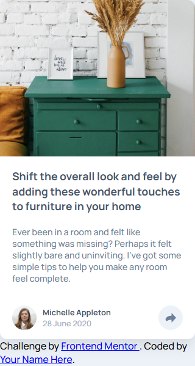
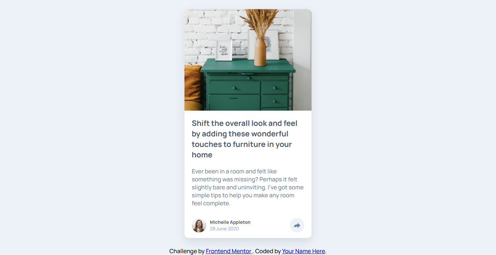

# Article Preview Component

## Overview

This is a responsive Article Preview Component built as part of a Frontend Mentor challenge.
The project demonstrates semantic HTML, modern CSS (mobile-first, Flexbox), and vanilla JavaScript for interactive elements.

### The Challenge
Build a responsive article card layout for mobile and desktop
Implement an animated share menu that expands the card instead of overlaying content
Match the design provided by Frontend Mentor
Ensure clean and maintainable code
Screenshots

### Mobile Preview:

### Desktop Preview:

## Links
## Solution URL: [GitHub Repository](https://github.com/HakimDev-tech/Article-Preview-Component)
## Live Site URL: (https://hakimdev-tech.github.io/Article-Preview-Component/)
### Built With
HTML5 & semantic elements
CSS3 (Flexbox, mobile-first, transitions)
JavaScript (vanilla, toggle share menu)
Google Fonts: Manrope
## Features
Fully responsive layout (mobile-first)
Animated share menu integrated in card flow (pushes content down)
Accessible HTML structure (aria-label, semantic tags, <time>)
Smooth transitions for interactive elements
Clean, maintainable, and readable code
## Author

Abdel Hakim Koumad

### GitHub: HakimDev-tech
### Frontend Mentor: @HakimDev-tech
Getting Started
Clone the repository:
git clone https://github.com/HakimDev-tech/Article-Preview-Component.git
Open index.html in your browser.
